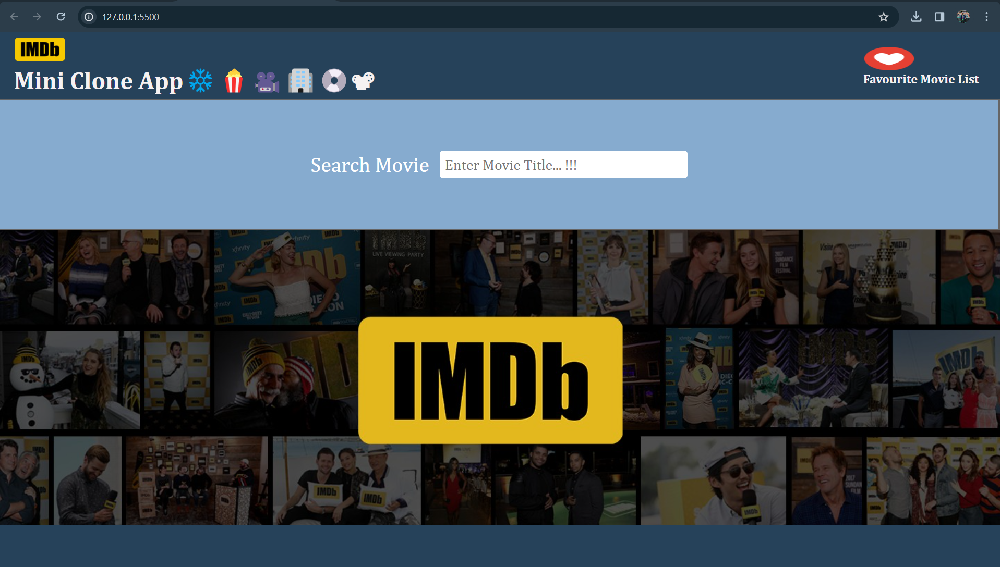
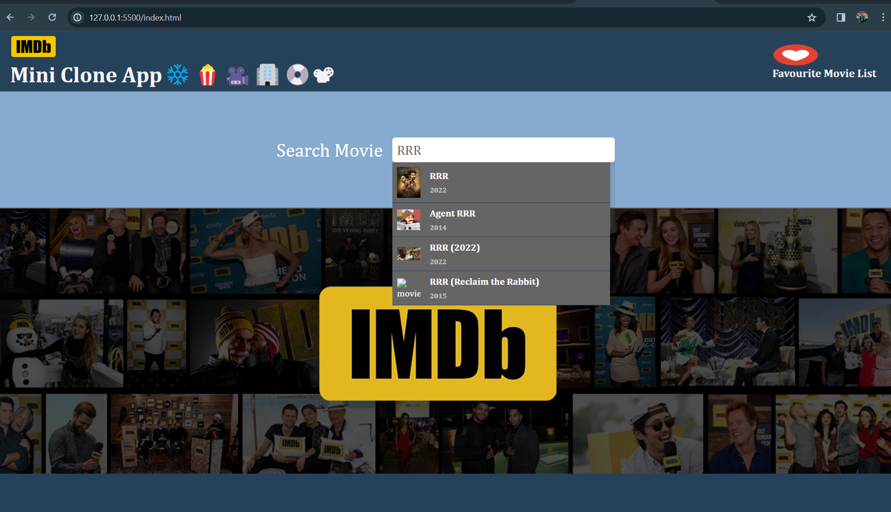
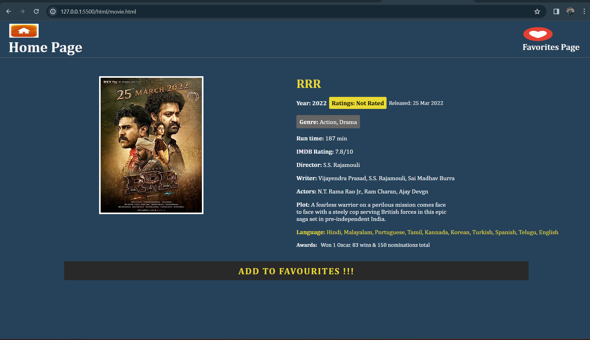
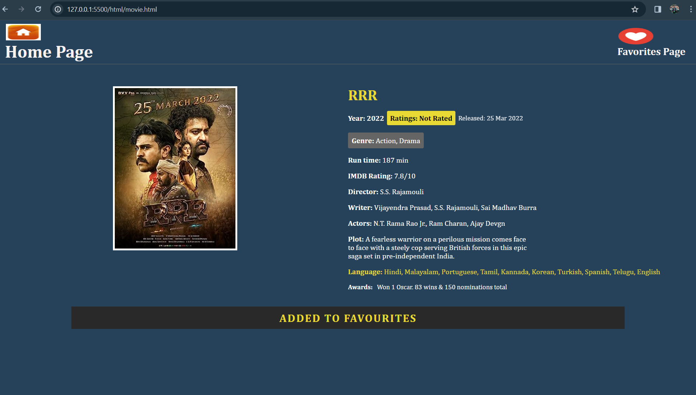
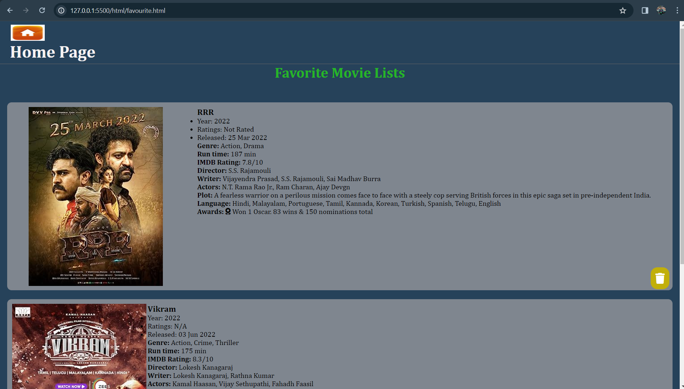
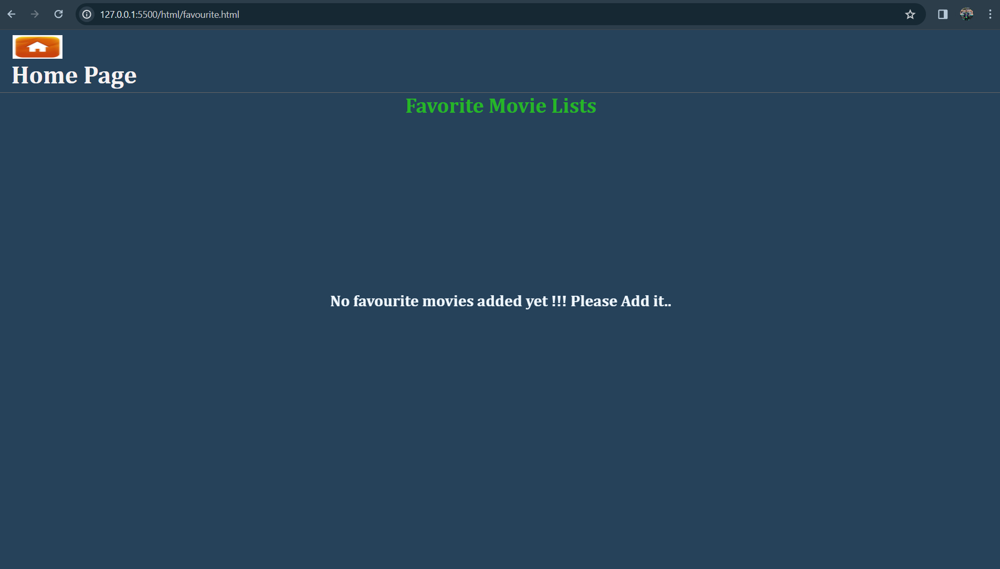

### **IMDb Mini Clone App**

The IMDb Mini Clone App is a web application that allows users to search for movies, view movie details, and manage a list of favorite movies. It provides a simple and user-friendly interface to explore movies and keep track of favorites.

### **Features**

1. Home Page: Search for movies using the IMDb API and display search results with real-time updating suggestions.
2. Movie Page: View detailed information about a selected movie, including its name, photo, plot, actors, etc.
3. Page: Manage a list of favorite movies with the ability to remove movies from the list.
4. Persistent Storage: Favorite movies list remains the same even after closing or refreshing the browser.

### **Technologies Used**

1. HTML
2. CSS
3. JavaScript
4. IMDb API

### **How to Use:**

1. Clone the repository: git clone https://github.com/JanardhanEJ/jana-imdb-mini-clone-application-project.git
2. Open index.html in your web browser.
3. Use the search bar on the home page to search for movies.
4. Click on a particular movie to view its details.
5. Click the 'Add to Favorites' button to add a movie to your favorites list.
6. Visit the 'Favorite' page to manage your list of favorite movies.

### **Screenshots:**

1. while opening index.html, you will see web page as below:
   

2 search movies in search box provided in the web page
for example: entering text RRR in search box.

All the values matching text will be displayed in search box list.

3. Click on the particular movie name
   for example: click on RRR movie from list, RRR Movie details will be displayed in another page: movie.html as below:
   

4. click on Add to favourites !! button; it shows movie is already added to favourite list as below:
   

5. click on favourites page to view your favourists list
   

6. delete the movie from favourite list; then that movie details will be deleted.
7. if no favourites movies in list; it will display the message like below:
   

### **Live Demo**
Link: https://janardhanej.github.io/jana-imdb-mini-clone-application-project/
